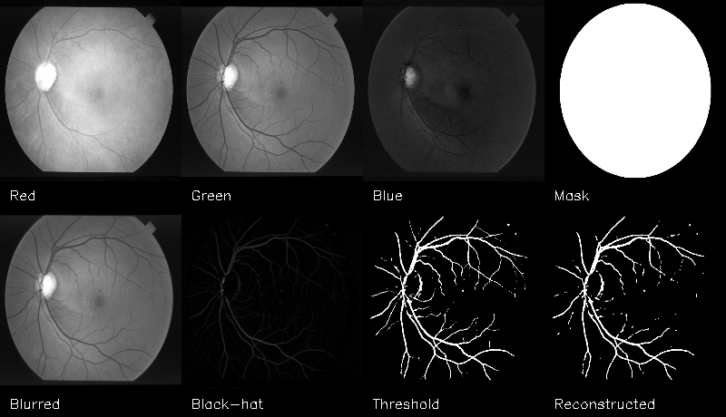

# Segmentação de Vasos Sanguíneos da Retina

## Descrição

Este projeto implementa um pipeline de processamento de imagens para segmentar vasos sanguíneos em imagens da retina. O código identifica e destaca os vasos, auxiliando profissionais de saúde no diagnóstico de doenças oculares.

## Datasets Suportados

### DRIVE (Digital Retinal Images for Vessel Extraction)
- 40 imagens (20 treino, 20 teste)
- Resolução: 565 x 584 pixels
- Formato: .tif

### STARE (STructured Analysis of the Retina)
- 20 imagens
- Resolução: 700 x 605 pixels
- Formato: .ppm

### HRF (High-Resolution Fundus)
- Imagens em alta resolução (3504 x 2336 pixels)
- Inclui máscaras e anotações manuais
- Formato: .jpg

## Parâmetros de Processamento

### Filtro Gaussiano
- **gaussian_kernel**: 
  - HRF: 7 (7x7)
  - DRIVE/STARE: 5 (5x5)
  - Função: Suavização inicial, tamanho ajustado à resolução

- **gaussian_sigma**: 
  - HRF: 1
  - DRIVE/STARE: 0
  - Função: Controle da intensidade da suavização

### Operação Morfológica
- **blackhat_kernel**: 
  - HRF: 40
  - DRIVE/STARE: 21
  - Função: Realce dos vasos sanguíneos
  - Nota: Valor maior no HRF devido à alta resolução

### Limiarização
- **initial_threshold**: 
  - HRF: 15
  - DRIVE/STARE: 10
  - Função: Valor base para limiarização Otsu

## Funcionalidades

- Extração de canais de cor (vermelho, verde, azul)
- Criação de máscara para isolar a região de interesse
- Aplicação de filtro gaussiano para suavização
- Realce de vasos usando operação black-hat
- Limiarização binária usando o método de Otsu
- Reconstrução morfológica para melhorar a segmentação
- Geração de imagens combinadas com todas as etapas do processo

## Requisitos

- Python 3.x
- OpenCV (cv2)
- NumPy
- tqdm

## Instalação

1. Clone este repositório:
   ```bash
   git clone https://github.com/seu-usuario/segmentacao-vasos-retina.git
   ```

2. Instale as dependências:
   ```bash
   pip install opencv-python numpy tqdm
   ```

## Estrutura do Projeto

```
├── datasets/
│   ├── DRIVE/
│   │   ├── training/
│   │   │   └── images/
│   │   └── test/
│   │       └── images/
│   ├── STARE/
│   │   └── images/
│   └── HRF/
│       ├── images/
│       ├── manual1/
│       └── mask/
├── resultados/
│   └── segmentacao/
│       ├── DRIVE/
│       ├── STARE/
│       └── HRF/
├── segmentacao_vasos_stare_drive.py
├── segmentacao_vasos_hrf.py
└── README.md
```

## Uso

1. Organize suas imagens nos diretórios apropriados seguindo a estrutura acima.

2. Para processar os datasets DRIVE e STARE:
   ```bash
   python segmentacao_vasos_stare_drive.py
   ```

3. Para processar o dataset HRF:
   ```bash
   python segmentacao_vasos_hrf.py
   ```

4. Os resultados serão salvos em `resultados/segmentacao/` com subdiretórios para cada dataset.

## Resultados

### Dataset STARE

*Exemplo de processamento no dataset STARE (565 x 584 pixels)*

### Dataset HRF

*Exemplo de processamento no dataset HRF (3504 x 2336 pixels)*

### Comparação de Parâmetros entre Datasets
| Parâmetro         | HRF | DRIVE/STARE |
| ----------------- | --- | ----------- |
| gaussian_kernel   | 7   | 5           |
| gaussian_sigma    | 1   | 0           |
| blackhat_kernel   | 40  | 21          |
| initial_threshold | 15  | 10          |

### Justificativa dos Ajustes
- Parâmetros otimizados para cada resolução de imagem
- HRF requer kernels maiores devido à resolução de 3504 x 2336 pixels
- Valores balanceados para preservar detalhes dos vasos
- Blackhat mais agressivo no HRF para compensar maior área de processamento
